<div align="center">

# 👋 Hey, I'm <span style="color:#BB9AF7;">Sungini</span>

### 💻 Full-Stack Developer • 🤖 AI/ML Enthusiast • 🧠 Problem Solver


<br>

<a href="https://github.com/sungin21">

</a>

<a href="https://www.linkedin.com/in/sunginirijhwani/">

</a>

</div>

---

## 🌙 About Me

<div align="center">

|    |                                                                        |
| -- | ---------------------------------------------------------------------- |
| 💻 | Full-stack developer passionate about building real-world applications |
| 🤖 | Exploring Artificial Intelligence & Machine Learning                   |
| 🚀 | Turning ideas into useful and impactful products                       |
| 🧠 | Improving problem-solving and Data Structures & Algorithms skills      |
| 🌱 | Learning new technologies and development practices every day          |
| ✨  | Focused on becoming a stronger and well-rounded software engineer      |

</div>

---

## 🛠️ Tech Stack

<div align="center">

### 💻 Languages


### ⚡ Frameworks & Development


### 🗄️ Databases & Tools


### 🤖 AI / ML


</div>

---

## 🚀 Featured Projects

<div align="center">

|             🧩 Project             | 💡 Description                                  |
| :--------------------------------: | :---------------------------------------------- |
|        🩸 **BloodCare App**        | Blood donation and donor locator platform       |
|      🍽️ **Restaurant Rater**      | Restaurant review and rating platform           |
|       🧭 **Pathfinder Code**       | Algorithm and pathfinding visualization project |
| 🤖 **Media Intelligence Platform** | AI-powered media analysis platform              |
|             🐍 **PFC**             | Python-based project                            |

</div>

---

## 📊 GitHub Stats

<div align="center">





<br><br>


</div>

---

## 📈 Sungini's Contribution Graph

<div align="center">


</div>

---

## 🎯 Currently Working On

<div align="center">

|          🌱 Learning         |       🚀 Building       |
| :--------------------------: | :---------------------: |
|     AI / Machine Learning    | Full-Stack Applications |
| Data Structures & Algorithms |   AI-powered Projects   |
|         System Design        |   Real-world Products   |
|        Cloud & DevOps        |       Open Source       |

</div>

---

## 🧠 My Developer Journey

<div align="center">

```text
💡 IDEA
   ↓
🧠 LEARN
   ↓
💻 BUILD
   ↓
🐛 DEBUG
   ↓
🚀 DEPLOY
   ↓
✨ IMPROVE
   ↓
🔁 REPEAT
```

</div>

---

## ⚡ A Little More About Me

<div align="center">

|    |                                                    |
| -- | -------------------------------------------------- |
| 🚀 | Building and experimenting with new projects       |
| 🌱 | Learning advanced full-stack development           |
| 🤖 | Exploring AI-powered applications                  |
| 🧩 | Practicing Data Structures & Algorithms            |
| 💡 | Turning ideas into working software                |
| 🎯 | Working toward becoming a strong software engineer |

</div>

---

## 🤝 Let's Connect

<div align="center">

<a href="https://github.com/sungin21">

</a>

<a href="https://www.linkedin.com/in/sunginirijhwani/">

</a>

</div>

<br>

<div align="center">

### ✨ Building Ideas. Solving Problems. Creating Impact. ✨

<br>

**🚀 Always Learning • Always Building • Always Improving**

<br><br>


</div>
